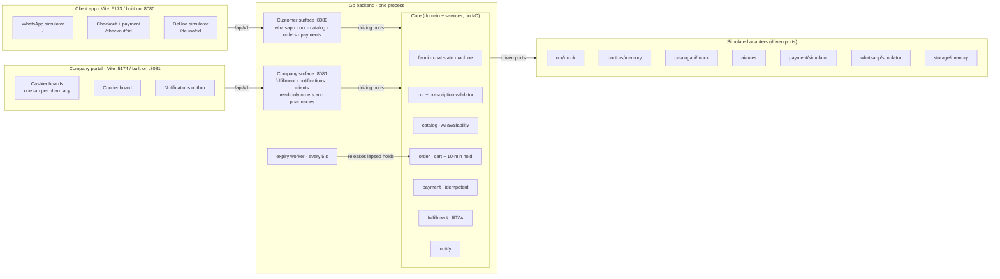
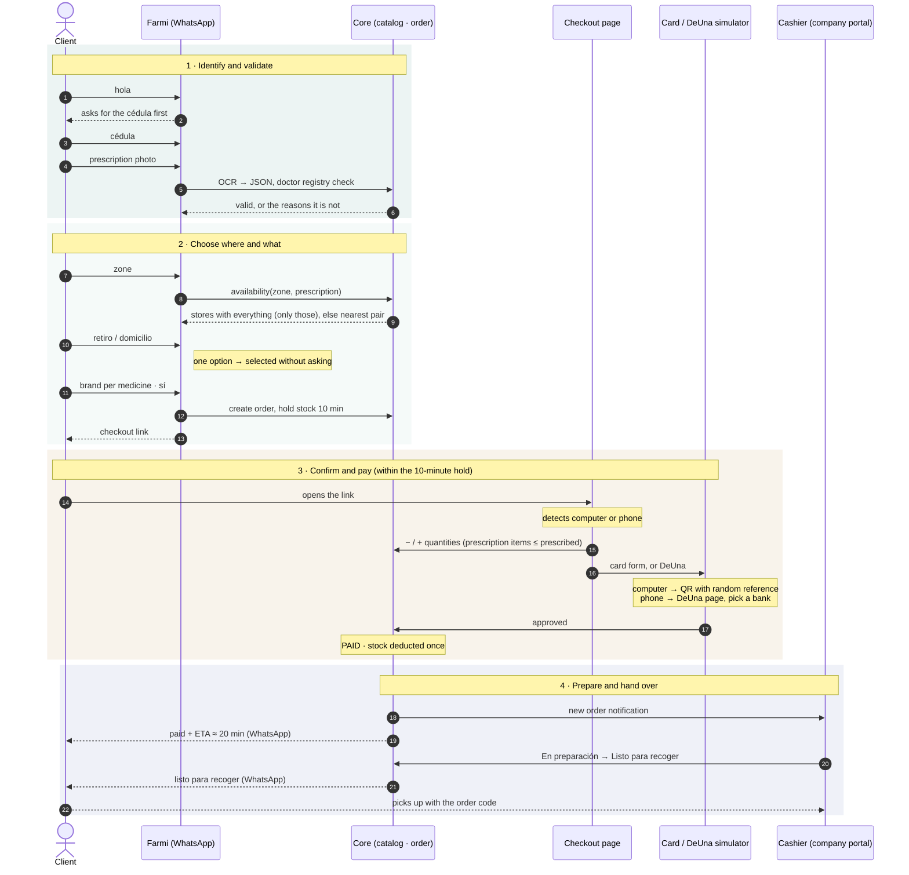
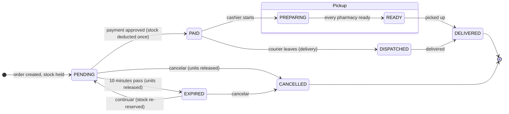
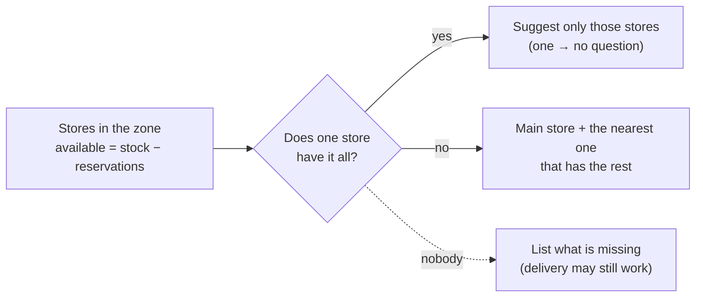
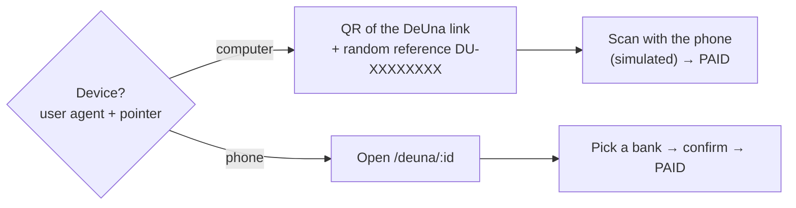

# Farmi — architecture and flow

Diagrams of the MVP. They render on GitHub and in any Mermaid-aware viewer. The REST contract is in
[`API.md`](API.md) and the business flow it implements is in [`../flujo_farmaenlace.md`](../flujo_farmaenlace.md).

## 1. Two apps, two API surfaces, one core

The customer experience and the company's back office are separate apps on separate ports. The Go backend is
one process with one set of data, but each port mounts only its half of the API: the client's browser cannot
reach the cashier board, and the portal cannot talk to the WhatsApp channel.

Swapping a simulator for the real system means writing one adapter and changing one line in
`backend/cmd/server/main.go`; the core, the chat flow and both apps stay as they are.

## 2. A pickup purchase, step by step

For a home delivery, step 2 asks for the address instead of a pharmacy, the company chooses the origin stores,
and in step 4 the courier board moves the order to **En reparto** (ETA ≈ 15 min) and **Entregado**.

## 3. Order states

## 4. Checkout rules

**Which pharmacy Farmi suggests**

**Prescription quantities.** A prescription item prescribed at 21 can go down to any amount and back up to 21,
never above (`RX_INCREASE_NOT_ALLOWED`). Zero removes the line, and the page asks before removing the last unit.
Over-the-counter items can grow as far as stock allows.

**DeUna by device**

The client can switch modes by hand ("Estoy en el celular" / "Estoy en un computador"). A cart change, a
rejection or an expiry voids the QR, and the next one carries a new reference.

**Card form.** Number with live grouping, brand detection (Visa, Mastercard, Amex, Diners, Discover) and the
Luhn check digit; cardholder; `MM/AA` expiry not in the past; CVV of 3 digits (4 on Amex). Errors show under each
field. Card data never leaves the browser: the sandbox number decides the outcome
(`4000 0000 0000 0002` → declined, any other valid number → approved).
