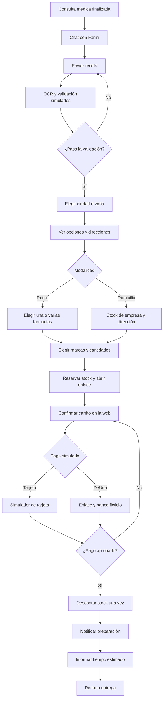

# Farmi: flujo de compra de medicamentos

**Alcance:** producto de prueba rápido. El chat de WhatsApp, OCR, registro de médicos, inventarios, pagos y notificaciones son simulados con datos ficticios. No se conectan APIs existentes ni se realizan cobros reales.

## 1. Inicio de la conversación

1. El cliente termina su consulta médica y recibe su receta.
2. Busca por WhatsApp al asistente de compras **Farmi**.
3. Farmi lo saluda y solicita una fotografía de la receta.

**Ejemplo:** “¡Hola! Soy Farmi. Envíame una foto de tu receta y te ayudo a encontrar tus medicamentos”.

## 2. Extracción y validación de la receta

1. El cliente carga una imagen de ejemplo.
2. El OCR simulado devuelve los datos precargados:
   - Paciente.
   - Fecha de emisión.
   - Nombre e identificador del médico.
   - Presencia de firma y sello.
   - Medicamentos, concentración, presentación y cantidades prescritas.
3. Farmi comprueba que los campos requeridos para el ejemplo estén completos.
4. Consulta una base ficticia de médicos y comprueba:
   - Médico registrado.
   - Estado activo.
   - Indicador de habilitación para prescribir en Ecuador.
5. Si la receta pasa las comprobaciones del demo, continúa.
6. Si faltan datos, la imagen es ilegible o el médico del ejemplo no está habilitado, informa el motivo y solicita otra receta.

Esta validación usa registros ficticios; no verifica autenticidad ni habilitación nacional real.

## 3. Ciudad o zona preferida

1. Farmi pregunta en qué ciudad o zona desea comprar.
2. El cliente selecciona una opción de ejemplo, como “Quito — zona norte”.
3. Farmi busca en el inventario simulado de Medicity y Farmacias Económicas.

## 4. Opciones de farmacias

Farmi muestra una lista con nombre de la farmacia, cadena, dirección y disponibilidad.

- **Receta completa en un local:** presenta primero las farmacias que cubren las cantidades de todos los medicamentos.
- **Receta repartida:** propone una farmacia principal y la farmacia más cercana a ella que tenga los medicamentos faltantes. Indica qué se recoge en cada una.
- **Faltantes sin solución:** informa qué medicamentos o cantidades no están disponibles antes de continuar.

La búsqueda considera los productos que cumplen los requisitos extraídos y las cantidades necesarias.

**Ejemplos ficticios:**

| Opción | Ubicación | Disponibilidad |
|---|---|---|
| Medicity Demo Norte | Dirección ficticia A | Toda la receta |
| Económicas Demo Centro + Medicity Demo Centro | Direcciones ficticias B y C | Receta completa entre ambos locales |

## 5. Elección entre retiro y domicilio

Farmi pregunta: **“¿Prefieres retirar en farmacia o recibir tu pedido a domicilio?”**

### Retiro en farmacia

1. El cliente elige la farmacia o combinación de farmacias.
2. El pedido conserva los locales elegidos y las cantidades que corresponde preparar en cada uno.
3. Las opciones de marcas se obtienen del inventario de esos locales.

### Entrega a domicilio

1. Farmi solicita la dirección de entrega.
2. Comprueba que la empresa tenga las cantidades de todos los medicamentos en su stock disponible.
3. La empresa decide internamente de dónde obtenerlos y cómo consolidar el pedido.
4. El cliente no necesita elegir farmacias ni coordinar varios retiros.
5. El sistema asigna una persona de entrega ficticia y muestra el costo de envío.

El stock de empresa se calcula desde las existencias de los puntos de origen del demo, sin duplicarlas en otro inventario.

## 6. Elección de marcas y precios

1. Farmi presenta las marcas elegibles de cada medicamento.
2. Para retiro, utiliza los locales seleccionados; para domicilio, los puntos de origen asignados internamente.
3. Cada opción muestra:
   - Marca.
   - Concentración y presentación.
   - Cantidad de tabletas o unidades.
   - Precio por unidad de venta.
   - Valor calculado para la cantidad solicitada.
4. El cliente selecciona una marca por medicamento.
5. Farmi arma el carrito y muestra el total, incluido el envío cuando corresponda.

En el demo, la venta por tableta se habilita solo para los productos de ejemplo definidos de esa manera.

**Ejemplo ficticio de carrito:**

| Producto | Condición | Cantidad | Precio unitario | Subtotal |
|---|---|---:|---:|---:|
| Medicamento A — Marca Alfa | Bajo receta | 20 tabletas | USD 0,40 | USD 8,00 |
| Medicamento B — Marca Beta | Venta libre | 10 tabletas | USD 0,20 | USD 2,00 |
| **Total de productos** | | | | **USD 10,00** |

Con un envío ficticio de USD 2,50, el total a domicilio sería **USD 12,50**.

## 7. Inicio de compra y reserva

1. El cliente confirma que desea comprar las opciones elegidas.
2. El sistema vuelve a comprobar el stock y crea un pedido pendiente.
3. Reserva las unidades de las marcas seleccionadas durante diez minutos.
4. Para retiro, reserva en las farmacias elegidas.
5. Para domicilio, reserva en los puntos de origen asignados por la empresa.
6. Las unidades reservadas dejan de estar disponibles para otros pedidos del demo.
7. Farmi envía un enlace a la página de confirmación y pago.

Si no se consigue reservar todo el carrito, Farmi informa el cambio y propone ajustar las opciones antes de generar el enlace.

## 8. Confirmación en la página web

La página muestra el carrito ya elegido, los locales de retiro o la dirección de entrega, el costo de envío, el total y el tiempo restante de reserva.

| Tipo de medicamento | Botón “+” | Botón “−” | Regla del demo |
|---|---|---|---|
| Venta libre | Habilitado | Habilitado | Aumentar o reducir, sujeto a stock |
| Bajo receta | Deshabilitado | Habilitado | Reducir; no aumentar desde esta página |

- Las cantidades se expresan en la unidad de venta de cada producto.
- Al reducir a cero, el producto queda en el carrito marcado en gris (no se cobra) y se puede volver a agregar.
- Si quedan menos unidades que las prescritas, la confirmación muestra esa diferencia.
- Cada cambio recalcula subtotales, total y reserva.
- Al reducir, se liberan las unidades sobrantes.
- Al aumentar un producto de venta libre, se comprueba y reserva el stock adicional.
- Si no hay stock adicional, se informa y se conserva la última cantidad válida.
- El carrito no puede pagarse si está vacío.

## 9. Elección del pago

### Tarjeta de débito o crédito

1. El cliente selecciona tarjeta.
2. La página muestra un simulador sin datos bancarios reales.
3. El cliente pulsa “Simular pago aprobado” o “Simular pago rechazado”.

### DeUna simulado

1. El cliente selecciona DeUna.
2. El sistema genera un enlace interno de prueba asociado al pedido y al total vigente.
3. El enlace abre una pantalla con bancos ficticios.
4. El cliente elige su banco de ejemplo.
5. Se muestra el mismo importe que aparece en la página de compra.
6. El cliente confirma o rechaza el pago simulado.

La selección de bancos pertenece al simulador; no representa capacidades verificadas de DeUna. Si cambia el carrito, se invalida la solicitud anterior y se genera otra por el nuevo total.

## 10. Pago confirmado e inventario

Cuando el simulador confirma el pago:

1. El pedido cambia a **PAGADO**.
2. Se descuentan del stock las cantidades compradas.
3. Se consumen las reservas correspondientes.
4. Se genera la confirmación del pedido.
5. Se notifica a las farmacias o puntos de preparación.

La confirmación repetida de un mismo pago no vuelve a descontar inventario.

**Modelo del demo:**

- Disponibilidad = stock − reservas.
- Reservar: aumentar reservas.
- Pagar: reducir stock y reducir la reserva por la misma cantidad.
- Cancelar o vencer: liberar reservas.
- Entregar: cambiar el estado del pedido, sin descontar stock otra vez.

## 11. Preparación y entrega

### Retiro

1. El cajero de cada farmacia recibe una notificación simulada.
2. La notificación contiene pedido, productos, marcas, cantidades y modalidad.
3. El cajero marca “En preparación” y luego “Listo para recoger”.
4. Farmi informa el código de pedido, direcciones y tiempo estimado de retiro.
5. Si son dos farmacias, muestra por separado el estado de cada retiro.

**Ejemplo:** “Tu pedido DEMO-001 estará listo en aproximadamente 20 minutos en Medicity Demo Norte”.

### Domicilio

1. Los responsables internos reciben la lista de productos a preparar.
2. La empresa consolida el pedido.
3. La persona de entrega recibe una notificación simulada con dirección y pedido.
4. El pedido pasa a “En reparto”.
5. Farmi informa el tiempo estimado de llegada.
6. La persona de entrega marca “Entregado”.

Todos los tiempos son valores de ejemplo.

## 12. Cancelación y vencimiento

- **Pago rechazado:** permitir reintentar mientras la reserva siga vigente.
- **Cliente cancela:** cancelar el pedido y liberar unidades.
- **Reserva vencida:** liberar stock e invalidar el pago pendiente.
- **Cliente vuelve después del vencimiento:** comprobar disponibilidad y generar una nueva reserva.
- **Confirmación tardía:** no preparar automáticamente; comprobar si el pedido todavía puede cumplirse antes de continuar.

## 13. Diagrama del recorrido

